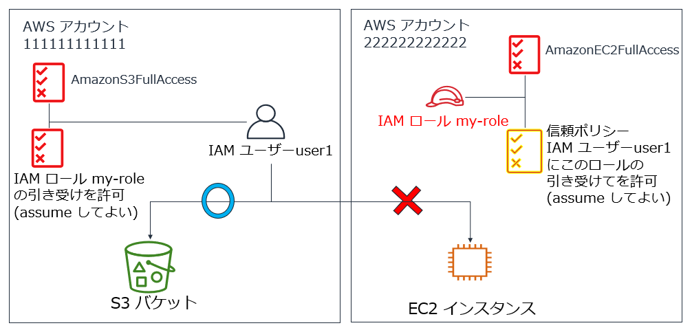
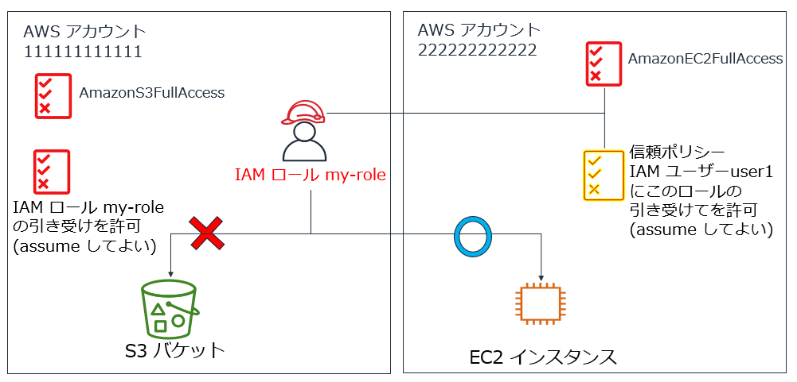

# IAM ロールを使用したクロスアカウントアクセスの例


### 前提
- アカウント 111111111111 では S3 の管理者である IAM ユーザー user1 が、アカウント 222222222222 に EC2 の管理者としてアクセスする
- 現在 アカウント 111111111111 で user1 に付与されている IAM ポリシーは Amazon S3FullAccess



---




### 手順
   
1. アカウント 222222222222 で　IAM ロール my-role を作成する。
    - 信頼ポリシーには下記を設定する
    ```
    {
	    "Version": "2012-10-17",
	    "Statement": [
		    {
			    "Effect": "Allow",
			    "Principal": {
			        "AWS": "arn:aws:iam::111111111111:root"
			    },
			    "Action": "sts:AssumeRole"
		    }
	    ]
    }
    ```
  
    - 上記の信頼ポリシーにより、アカウント 111111111111 内の IAM の ID に設定される許可ポリシーにより、この IAM ロールの引き受け（使用）の可否が決められることになる。
    - ちなみに、下記のように user1 に限定することもできる
    ```
    {
        "Version": "2012-10-17",
        "Statement": [
            {
                "Effect": "Allow",
                "Principal": {
                    "AWS": "arn:aws:iam::111111111111:user/user1"
                },
                "Action": "sts:AssumeRole"
            }
        ]
    }
    ```

  - 許可ポリシーには、AmazonEC2FullAccess を付与する


1. アカウント 111111111111 の IAM ユーザー user1 に IAM ロール my-role を引き受けてよい（使用してよい）という許可ポリシーを追加する

    ```
    {
        "Version": "2012-10-17",
        "Statement": [
            {
                "Sid": "VisualEditor0",
                "Effect": "Allow",
                "Action": "sts:AssumeRole",
                "Resource": "arn:aws:iam::222222222222:role/my-role"
            }
        ]
    }
    ```

1. ロールを切り替えてクロスアカウントアクセスを行う
    - AWS マネジメントコンソールで IAM ユーザー user1がアカウント 111111111111 にサインインする
    - ページ右上でユーザー名の部分をクリックし、[ロールの切り替え] をクリックする
    - アクセス先のアカウント ID (222222222222) とロール名 (my-role) を入力して [ロールの切り替え] をクリックする
    - もとのアカウントに戻る場合は下記の手順を行う
        - ページ右上でユーザー名の部分をクリックし、[スイッチバック] をクリックする
